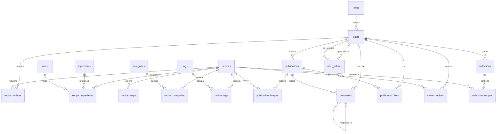

# Modelo relacional de Recetaria

## Propósito y alcance

Este documento es la vista visual vigente del modelo relacional de Recetaria. Permite localizar rápidamente sus 20 tablas de dominio, relaciones y cardinalidades.

Los atributos, claves, índices, restricciones y reglas funcionales de cada relación se detallan en [Atributos del modelo relacional](atributos-modelo-relacional.md). Las tablas técnicas de Laravel, como sesiones, caché o trabajos, no forman parte de este modelo de dominio.

## Diagrama

## Tablas del dominio

- Usuarios y roles: `roles`, `users`.
- Núcleo culinario: `recipes`, `recipe_authors`, `ingredients`, `units`, `recipe_ingredients`, `recipe_steps`.
- Clasificación: `categories`, `recipe_categories`, `tags`, `recipe_tags`.
- Capa social: `publications`, `publication_images`, `comments`, `publication_likes`, `saved_recipes`, `collections`, `collection_recipes`, `user_follows`.

El modelo contiene exactamente 20 tablas de dominio.

## Reglas complementarias

### Usuarios y roles

- Cada usuario tiene exactamente un rol. El catálogo es extensible y contiene inicialmente `member` y `admin`.
- Todo registro público de usuario recibe el rol `member` sin depender de un identificador numérico codificado.
- Las capacidades de los roles y las reglas de autorización se definirán en otra especificación.

### Recetas

- Cada receta conserva uno o más coautores equivalentes y aparece en el perfil público de todos ellos cuando está publicada.
- Una receta puede permanecer como borrador privado. Para publicarla debe contener al menos un ingrediente y un paso, y no puede quedar incompleta mientras siga publicada.
- Despublicar una receta conserva sus referencias, guardados y pertenencias a colecciones, pero los oculta de la vista pública. Al republicarla vuelven a mostrarse.
- Las categorías y etiquetas son opcionales, globales y planas. La unidad de un ingrediente dentro de una receta también es opcional.

### Publicaciones e interacción

- Cada publicación pertenece a un usuario y contiene entre una y diez imágenes; la imagen en la posición `1` es la portada.
- Cada imagen puede enlazar, como máximo, una receta publicada. Varias imágenes pueden enlazar la misma receta y una publicación puede no enlazar ninguna.
- Si una receta enlazada vuelve a borrador, la referencia se conserva pero el enlace y sus metadatos se ocultan; reaparecen al republicarla.
- Las publicaciones y las recetas tienen ciclos de vida independientes y no conservan versiones históricas entre sí.
- Los likes pertenecen a publicaciones y no admiten tipos de reacción.
- Los comentarios pertenecen a una publicación, permiten respuestas con anidamiento ilimitado y exigen que padre e hijo pertenezcan a la misma publicación.

### Guardados, colecciones y seguimiento

- Los guardados pertenecen a recetas y cada par usuario-receta es único.
- Cada colección es privada, pertenece a un usuario y no puede contener dos veces la misma receta.
- Añadir una receta a una colección exige o crea su guardado para el propietario. Si la receta vuelve a borrador, ambos registros se conservan pero se ocultan públicamente.
- El orden de una colección se deriva de la fecha de incorporación y utiliza el identificador como desempate estable.
- El seguimiento entre usuarios es dirigido, cada par seguidor-seguido es único y un usuario no puede seguirse a sí mismo.

## Decisiones aplazadas

Este documento no define políticas de borrado, migración de datos existentes, autorización o moderación, contrato del primer administrador, integración técnica con Cloudinary ni mecanismos ejecutables para las reglas que afectan a varias filas o tablas.

Consulta [Atributos del modelo relacional](atributos-modelo-relacional.md) para conocer el contrato detallado y el funcionamiento de cada relación.
