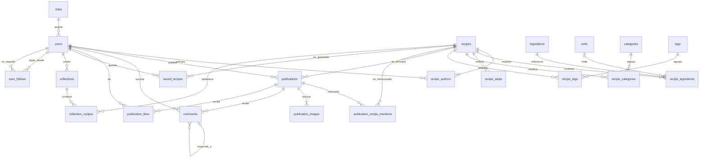

# Modelo relacional inicial de Recetaria

## Propósito y alcance

Este documento representa el modelo relacional conceptual aprobado para el dominio inicial de Recetaria. Solo muestra tablas, relaciones y cardinalidades; no define atributos, claves, índices, restricciones SQL, migraciones ni políticas de borrado.

Las tablas técnicas de Laravel, como sesiones, caché o trabajos, no forman parte de este diagrama de dominio.

## Diagrama

## Tablas del dominio

- Usuarios y roles: `roles`, `users`.
- Núcleo culinario: `recipes`, `recipe_authors`, `ingredients`, `units`, `recipe_ingredients`, `recipe_steps`.
- Clasificación: `categories`, `recipe_categories`, `tags`, `recipe_tags`.
- Capa social: `publications`, `publication_recipe_mentions`, `publication_images`, `comments`, `publication_likes`, `saved_recipes`, `collections`, `collection_recipes`, `user_follows`.

El modelo contiene exactamente 21 tablas de dominio.

## Reglas complementarias

### Usuarios y administración

- Cada usuario tiene exactamente un rol. Los roles iniciales son `member` y `admin`, y `member` es el predeterminado.
- El administrador puede gestionar usuarios, asignarles roles, gestionar cualquier colección, moderar contenido, administrar categorías, etiquetas, ingredientes y unidades, y consultar contenido no público.
- El administrador no puede acceder a credenciales, suplantar sesiones ni eliminar o degradar al último administrador.
- La implementación de estas reglas, incluida la creación del primer administrador, se definirá en otra especificación.

### Recetas

- Cada receta tiene uno o más coautores equivalentes.
- Una receta en borrador puede no tener ingredientes o pasos, pero para ser principal en una publicación debe tener al menos un ingrediente y un paso.
- Las categorías y etiquetas son opcionales, globales y planas.
- Cada par receta-autor, receta-ingrediente, receta-categoría y receta-etiqueta debe evitar duplicados cuando se definan sus restricciones.
- La unidad de un ingrediente dentro de una receta es opcional.

### Publicaciones e interacción

- Cada publicación tiene exactamente un publicador y una receta principal, que puede ser propia o ajena.
- Cada publicación tiene una o más imágenes. Las recetas no poseen imágenes en este modelo.
- Una publicación puede mencionar otras recetas, pero no puede repetir como mención su receta principal.
- No existe ninguna relación entre publicaciones: republicar significa crear una publicación nueva cuya receta principal puede pertenecer a otros autores.
- Los likes pertenecen únicamente a publicaciones y cada par usuario-publicación es único.
- Los comentarios pertenecen a una publicación y admiten respuestas con anidamiento ilimitado. Una respuesta debe pertenecer a la misma publicación que su comentario padre.

### Guardados, colecciones y seguimiento

- Los guardados pertenecen únicamente a recetas y cada par usuario-receta es único.
- Cada colección pertenece a un único usuario y cada par colección-receta es único.
- Añadir una receta a una colección exige o crea el guardado correspondiente para el propietario de la colección.
- El seguimiento entre usuarios es dirigido, cada par seguidor-seguido es único y un usuario no puede seguirse a sí mismo.

## Decisiones aplazadas

Antes de crear migraciones deberán definirse los atributos, las claves, las restricciones SQL, las políticas de borrado y la migración de usuarios existentes. La autorización requerirá además una especificación propia para los permisos, la auditoría, la suspensión, la visibilidad y la protección técnica del último administrador.
